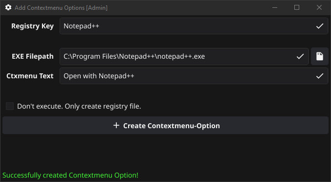
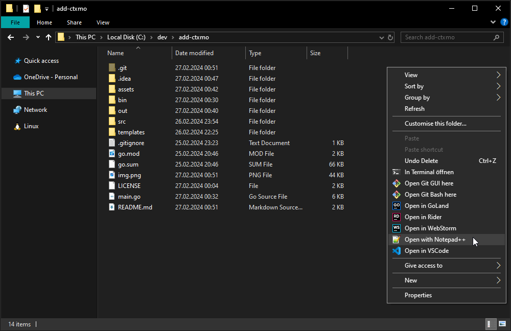
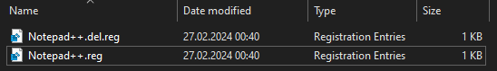

# Welcome to add-ctxmo 👋
[](https://github.com/floholz/add-ctxmo)
[](https://github.com/floholz/add-ctxmo/releases/latest)
[](./LICENSE)
[](https://go.dev/dl/)


> add-ctxmo is a tool written in Go and using the [fyne](https://github.com/fyne-io/fyne) UI library, to easily add contextmenu options for Windows File-Explorer. 

## Install

Download the latest version from [releases](https://github.com/floholz/add-ctxmo/releases/latest)

or 
```bash
go install github.com/floholz/add-ctxmo@latest
```

## Usage
1. Set the `Registry Key`. This value will also be used to as a filename for the registry files.
2. Select the executable, this contextmenu option should call.
   1. Either type the path to the executable, 
   2. or select it from the file dialog.
3. Set the text, that will appear in the contextmenu.
4. _(optional)_ You can select to only generate `.reg` files and don't execute them, by checking the checkbox. 
5. Click the button to generate the registry files and create the contextmenu option. 



The contextmenu option should look something like this.



The tool will always generate two registry files in the app directory.

* One `.reg` file, representing a registry file to add the registry entries.
* One `.del.reg` file, representing a registry file to remove these registry entries.



## Environment Variables

### `ADDCTXMO_PATH`
With this environment variable you can set the app path, where all registry files will be generated at.

By default, the registry files will be saved to `$HOME/.addctxmo/`.

_e.g.:_
```bash
ADDCTXMO_PATH="C:\my-custom-dir\add-ctxmo"
```

---

### 🤝 Contributing

Contributions, issues and feature requests are welcome!

Feel free to check [issues page](https://github.com/floholz/add-ctxmo/issues).


### 📝 License

Copyright © 2024 [floholz](https://github.com/floholz).

This project is [MIT](./LICENSE) licensed.

---

### Show your support

Give a ⭐ if this project helped you!